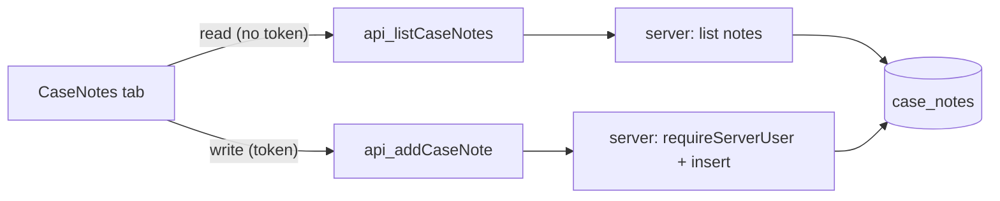

# Future Work — Case Notes Tab

> One-click execution plan. Hand this file to the agent and say "execute the plan
> in `future work/case-notes-tab.plan.md`". It contains everything needed: the
> confirmed decisions, the full task breakdown, and the exact commands.

---

## Goal (one line)

Add an append-only **Notes tab** to the case detail page where everyone working a
case can post short, timestamped, attributed notes. Professional notes feed, not a
chat: notes cannot be edited or deleted once posted.

## Confirmed decisions (locked with the user)

1. **Read + write access**: SUPER_ADMIN, ADMIN, MAKER, CHECKER, UPLOADER.
   **SITE_ENGINEER is excluded** (no read, no write — they use the field visit form).
   → UPLOADER must gain full `cases.detail` access so it can reach the page and all tabs.
2. **Lifecycle**: post-only, **immutable**. No edit, no delete, for anyone. Clean audit trail.
3. **Content per note**: plain-text body + author name + author role + created timestamp.
4. **Display**: newest note at the top, add-note box pinned above the list,
   "No notes yet" empty state, author name + role badge + timestamp per note.

## Scope

Touches: `src/db/schema.ts` (+ migration), `src/types`, `src/schemas`,
`src/server/api.server.ts`, `src/data`, `src/lib/permissions.ts`,
`src/components/case/CaseNotes.tsx` (new), `src/routes/_app/cases.$caseId.index.tsx`.

---

## Background — how the stack works (so edits match existing patterns)

- **DB**: Drizzle + Neon Postgres, snake_case columns, defined in `src/db/schema.ts`.
  Migrations: `npx drizzle-kit generate` then `npx tsx src/db/migrate.ts` (both read
  `DATABASE_URL` from `.env.local`, endpoint **`ep-muddy-math-b3on57py` / `neondb`**).
- **Server**: `src/server/api.server.ts` holds DB access functions. Auth is
  `requireServerUser(token, ...roles)` (in `src/server/auth.server.ts`), which verifies
  a Neon Auth JWT and resolves the authoritative app user `{ id, name, email, role }`
  from `neon_auth."user"`. The browser passes only a token, never an id/role.
- **Data layer**: `src/data/*.functions.ts` wraps server functions with `createServerFn`.
  Guard-gated reads (like `api_getCaseFieldVisit`) pass **no token**; writes (like
  `api_submitFieldVisit`) pass the **session token**.
- **UI**: case detail uses shadcn `Tabs`; `getSessionToken()` / `useCurrentUser()` from
  `@/lib/auth-client`; server state via `@tanstack/react-query`; toasts via `sonner`.
- **Permissions**: `src/lib/permissions.ts` maps roles → permissions. `cases.detail`
  currently **excludes UPLOADER**. The case detail page computes `backTo`/`backLabel`
  per role and currently has **no UPLOADER branch** (falls through to `/my-cases`).
- **Reference files to mirror**:
  - Read pattern (no token, guard-gated): `api_getCaseFieldVisit` in
    `src/data/fieldVisit.functions.ts` + `src/server/api.server.ts`.
  - Write pattern (token + role check): `api_submitFieldVisit` / `api_assignMaker`.
  - UI submit + invalidate + toast: `handleAssignMaker` in
    `src/routes/_app/cases.$caseId.index.tsx`.

## Solution shape



Add a `case_notes` table (one case → many notes), a guard-gated read
(`api_listCaseNotes`, no token) and a token-verified write (`api_addCaseNote` with
role check), thin data-layer wrappers, a Zod schema for the note body, and a
`CaseNotes` tab component wired into the case detail page. Grant UPLOADER
`cases.detail`, add a `notes.access` permission (excludes SITE_ENGINEER) to gate the
tab in the UI, and add an UPLOADER back-navigation branch. The server role check is
the real authority; the UI gate just hides the tab from SITE_ENGINEER.

---

## Git safety (read before starting)

This touches schema + shared permissions + the case detail page (5+ files,
foundational code, a migration). Per the workspace git rules:

1. Confirm the working tree builds / is usable.
2. **Checkpoint commit before Task 1**:
   `git add -A && git commit -m "checkpoint: before case notes tab"` then
   `git push origin <branch>`.
3. Keep the tree green — run `npx tsc --noEmit` **and** `npm run build` and only
   commit when both pass (never commit a partial mix of new components with stale
   types/schema).
4. Never rewrite pushed history; never `git stash`; back up before any bulk delete.

DB rule: before running the migration, verify the active endpoint host is
`ep-muddy-math-b3on57py...`. If it is anything else, STOP and fix `.env.local`.

---

## Task breakdown

### Task 1 — Add the `case_notes` table + migration
- In `src/db/schema.ts` add a `caseNotes` pgTable:
  - `id` uuid pk `defaultRandom()`
  - `case_id` uuid **not null**, FK → `cases.id`, `onDelete("restrict")`, indexed
  - `author_id` uuid **not null** (plain — users live in `neon_auth`, no app FK)
  - `author_name` varchar(255) **not null**
  - `author_role` varchar(50) **not null**
  - `body` text **not null**
  - `created_at` timestamptz **not null** `defaultNow()`, indexed
- Add `caseNotesRelations` (note → one case) and extend `casesRelations` with
  `notes: many(caseNotes)`.
- Generate + apply migration:
  ```bash
  npx drizzle-kit generate
  # verify endpoint is ep-muddy-math-b3on57py, then:
  npx tsx src/db/migrate.ts
  ```
- **Test**: `npx tsc --noEmit`; confirm the `case_notes` table exists in Neon (read-only).
- **Demo**: `case_notes` table exists with the correct columns + FK + indexes.

### Task 2 — `CaseNote` type + note-body Zod schema
- Add a `CaseNote` type to `src/types`:
  `{ id, caseId, authorId, authorName, authorRole, body, createdAt }`.
- Add `addCaseNoteSchema` (in `src/schemas/case.schema.ts`, or a new
  `src/schemas/caseNote.schema.ts` matching the field-visit convention):
  `body` trimmed, `.min(1, "Note cannot be empty")`, `.max(2000, ...)`. Export the
  inferred input type (e.g. `AddCaseNoteInput`).
- **Test**: `npx tsc --noEmit`; parse check (valid passes; empty/oversized rejected).
- **Demo**: `CaseNote` + `addCaseNoteSchema` import and validate as expected.

### Task 3 — Server data access (list + add)
In `src/server/api.server.ts` add:
- `api_listCaseNotes(caseId)`: select notes for the case ordered `created_at DESC`,
  map rows → `CaseNote`. Guard-gated read (no token), mirroring `api_getCaseFieldVisit`.
- `api_addCaseNote(token, caseId, input)`:
  - `requireServerUser(token, "SUPER_ADMIN","ADMIN","MAKER","CHECKER","UPLOADER")`
    (SITE_ENGINEER excluded → throws Forbidden).
  - Validate `input` with `addCaseNoteSchema`.
  - Verify the case exists.
  - Insert with `author_id/author_name/author_role` **snapshotted from the verified
    user** (never client-supplied). Return the created `CaseNote`.
- **Test**: `npx tsc --noEmit`; review that SITE_ENGINEER / invalid token throw;
  scoped manual insert check, delete any test row afterward.
- **Demo**: allowed role persists a note; disallowed role / empty body is rejected.

### Task 4 — Data-layer wrappers
- In `src/data/case.functions.ts` (or a new `src/data/caseNote.functions.ts`
  following the field-visit split) add `createServerFn` wrappers:
  - `api_listCaseNotes(caseId)` — GET, **no token**.
  - `api_addCaseNote(token, caseId, data)` — POST.
- Export thin client functions with JSDoc matching the existing style.
- **Test**: `npx tsc --noEmit`.
- **Demo**: client-importable functions resolve without leaking server code into the
  client bundle.

### Task 5 — Permissions
In `src/lib/permissions.ts`:
- Add **UPLOADER** to `cases.detail`.
- Add a new `notes.access` permission = `[SUPER_ADMIN, ADMIN, MAKER, CHECKER, UPLOADER]`
  (excludes SITE_ENGINEER). Add it to the `Permission` union and the `permissionRoles`
  map. Used only to gate the UI tab/add-box; the server (Task 3) is the real authority.
- **Test**: `npx tsc --noEmit`; check `can("SITE_ENGINEER","notes.access") === false`
  and `can("UPLOADER","cases.detail") === true`.
- **Demo**: permission map reflects new access; UPLOADER resolves the case-detail guard.

### Task 6 — `CaseNotes` tab component
New `src/components/case/CaseNotes.tsx`, props `{ caseId }`:
- `useQuery(["case-notes", caseId], () => api_listCaseNotes(caseId))`.
- Render (for `notes.access` roles): add-note box pinned on top (textarea + "Add note"
  button, disabled while empty/submitting), then the notes list **newest-first** — each
  note shows author name, small role `Badge`, formatted timestamp, and body.
- Empty state: "No notes yet." Loading: `Skeleton`.
- On submit: `getSessionToken()` → `api_addCaseNote(token, caseId, { body })` →
  `invalidateQueries(["case-notes", caseId])` → clear box → success/error toast
  (mirror `handleAssignMaker`).
- **Test**: `npx tsc --noEmit`; manual: post a note, it appears at top and box clears.
- **Demo**: self-contained panel that lists + adds notes with attribution + timestamps.

### Task 7 — Wire the tab into case detail + UPLOADER back-nav
In `src/routes/_app/cases.$caseId.index.tsx`:
- Add a third `TabsTrigger`/`TabsContent` "Notes" rendering
  `<CaseNotes caseId={valuationCase.id} />`, shown only when the current user has
  `notes.access` (hidden for SITE_ENGINEER).
- Add an UPLOADER branch to the `backTo`/`backLabel`/`backAction` resolver so
  UPLOADER's back button is correct now that they reach case detail (point at the
  uploader list route; today `uploader.$caseId.tsx` crumbs back to `/cases`, so use
  the appropriate uploader landing).
- **Test**: `npx tsc --noEmit` **and** `npm run build` (both green per the consistency
  guard). Manual smoke per role: SITE_ENGINEER sees only Overview + Field Visit;
  MAKER/CHECKER/UPLOADER/admins see Notes and can post.
- **Demo**: open a case as an allowed role → Notes tab → add a note → it appears
  timestamped + attributed at the top; open as SITE_ENGINEER → no Notes tab.

---

## Final acceptance checklist

- [ ] `case_notes` table live in `ep-muddy-math-b3on57py / neondb` with FK + indexes.
- [ ] Notes are immutable (no edit/delete path anywhere).
- [ ] Allowed roles (SUPER_ADMIN, ADMIN, MAKER, CHECKER, UPLOADER) can read + post.
- [ ] SITE_ENGINEER sees no Notes tab and is rejected server-side if it tries.
- [ ] Each note shows author name + role badge + timestamp; newest first; add box on top.
- [ ] `npx tsc --noEmit` and `npm run build` both green before any commit.
- [ ] Checkpoint commit made before Task 1; final work pushed to `origin`.
